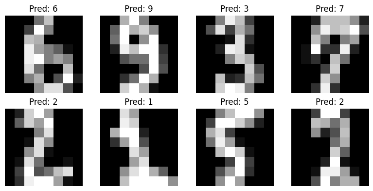

#  Handwritten Digit Recognizer using KNN

This project uses the **K-Nearest Neighbors** algorithm to classify handwritten digits from the **sklearn digits dataset**.

##  Libraries Used
- scikit-learn
- matplotlib
- numpy

##  Dataset
- Built-in `load_digits()` dataset from `sklearn`
- 1797 samples of 8x8 grayscale images

##  How It Works
- Load and visualize digit images
- Train-test split
- KNN model training
- Prediction & evaluation
- Visualization of results

##  Output Example



##  How to Run

```bash
pip install -r requirements.txt
python digit_recognizer.py


